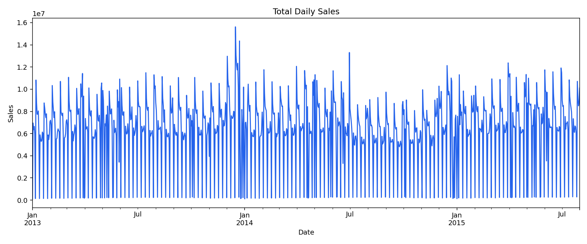
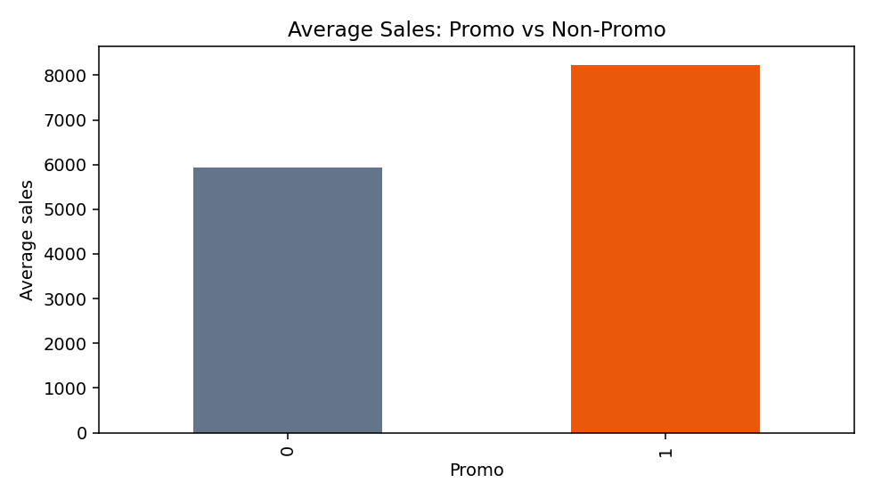
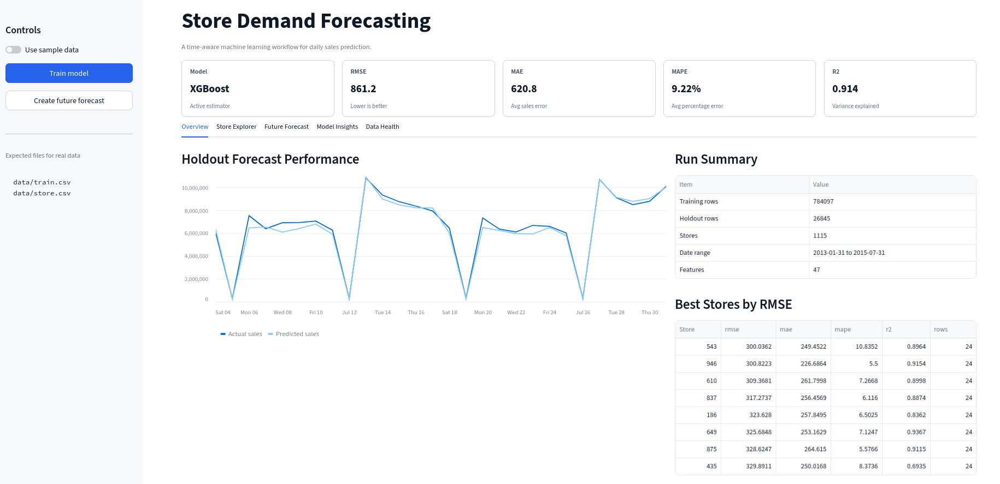

# Demand Forecasting for Retail Stores


> **Predicting daily store sales with XGBoost. 9.2% MAPE, 0.91 R², and a Streamlit dashboard that makes the results tangible.**

---

## The Motivation Behind the Project

In retail, demand isn’t random — but it often feels that way. Store managers and planners need to know whether next week will be busy or quiet. This project asks a concrete question:

> *Can we predict daily store sales accurately enough to support inventory, staffing, and promotion decisions?*

I built this project to showcase a complete forecasting workflow, from raw data to a deployable dashboard. This a production‑style machine learning system designed to run reliably and be understood by business users.

---

## Business Value at a Glance

- **9.2% average error (MAPE)** means planners can trust the numbers for most operational decisions
- **Over 91% of sales variability explained (R² 0.914)** — the model captures the main demand drivers
- The model **cuts RMSE by more than half** compared to simply repeating yesterday’s sales or last week’s sales
- A recursive forecasting loop generates predictions for **future dates where sales are truly unknown**, not just back-testing
- A **Streamlit dashboard** translates model outputs into clear visuals for non‑technical stakeholders

---

## What Makes This Project Different

Many forecasting projects rely on random train/test splits that leak future information.

| Principle | Implementation |
|-----------|----------------|
| **Time‑aware validation** | Chronological holdout — train on the past, evaluate on the future |
| **Leakage‑conscious features** | Rolling averages and lags are shifted so the model never sees its own future |
| **Baseline comparison** | The model must beat naive “yesterday” and “last week” forecasts — and it does, dramatically |
| **Recursive forecasting** | Future predictions feed back into the feature pipeline, simulating real‑world use |

---

## How It Works – The Pipeline

```text
Raw sales & store data
  → Clean & validate
    → Feature engineering (calendar, competition, promotions, lags, rolling means)
      → Time‑based train/holdout split
        → XGBoost training with log‑transformed target
          → Baseline evaluation
            → Recursive future forecast generation
              → Dashboard & saved artifacts
```
Every step is modular and reproducible. The configuration is centralized in a single YAML file, and the whole pipeline can be rerun with a single make train command. 

## Dataset

The project uses the Rossmann Store Sales dataset shape:

- `train.csv`: historical store sales
- `store.csv`: store-level metadata
- `test.csv`: future rows where sales are unknown

A small synthetic sample dataset is included in `data/sample/` so the project remains runnable after cloning.

## Modeling Approach

The workflow is deliberately time-aware:

1. Load sales and store metadata.
2. Validate required columns.
3. Clean missing values and closed-store rows.
4. Build calendar and business features.
5. Build lag and rolling sales features per store.
6. Hold out the latest dates for evaluation.
7. Train XGBoost.
8. Compare against simple baselines.
9. Generate recursive forecasts for future rows.
10. Save metrics, diagnostics, and dashboard-ready artifacts.

## Why Time-Aware Validation Matters

Random train/test splits can leak future information into training. This project uses a chronological holdout:

> Train on the past, evaluate on the future.

That makes the evaluation closer to the way the model would be used in practice.

## Why Baselines Matter

A forecasting model should beat simple rules before it is considered useful.

This project compares XGBoost against:

- yesterday's sales
- same store's sales from seven days ago

XGBoost performs substantially better than both baselines.

# Features That Drive the Forecast
I engineered three groups of features because demand patterns are multi-dimensional:

## Calendar features capture seasonality
- Day of week, month, year, week of year
- Weekend, month-start, month-end flags

## Business features capture store-specific context
- Promotions (`Promo`, `Promo2` interval matching)
- Competition distance and how long the competitor has been open
- Store type and assortment

## Sales history features (computed per store) capture momentum
- Lagged sales: 1 day, 7 days, 14 days
- Rolling means: 7-day and 14-day averages shifted by one day to avoid leakage

The feature engineering respects a crucial rule: at prediction time, only information that would have been available on that day is used.

---
## Results

Real Rossmann holdout results:
| Metric | Value |
|---|---:|
| RMSE | 861.246 |
| MAE | 620.781 |
| MAPE | 9.225% |
| R2 | 0.914 |

Baseline comparison:
| Method | RMSE | MAE | MAPE | R2 |
|---|---:|---:|---:|---:|
| XGBoost | 861.246 | 620.781 | 9.225% | 0.914 |
| Naive yesterday | 1,934.502 | 1,295.557 | 19.944% | 0.568 |
| Seasonal naive last week | 2,915.972 | 2,304.144 | 36.533% | 0.018 |

See [docs/RESULTS.md](docs/RESULTS.md) for interpretation.

## EDA Preview
Full report: [docs/EDA_REPORT.md](docs/EDA_REPORT.md)

### Total Daily Sales


### Promotion Lift


## Dashboard


The Streamlit dashboard includes:
- Overview
- Store Explorer
- Future Forecast
- Model Insights
- Data Health

Run it locally:
```bash
make dashboard
```

## Repository Structure
```text
demand-forecasting/
├── .streamlit/config.toml
├── app/
│   └── dashboard.py
├── config/
│   └── config.yaml
├── data/
│   └── sample/
├── docs/
│   ├── assets/plots/
│   ├── DATA_GUIDE.md
│   ├── DEPLOYMENT.md
│   ├── EDA_REPORT.md
│   └── RESULTS.md
├── src/
├── tests/
├── Dockerfile
├── docker-compose.yml
├── Makefile
├── TECHNICAL_NOTES.md
└── requirements.txt
```

## Quick Start With Sample Data

```bash
python -m venv .venv
source .venv/bin/activate
pip install -r requirements.txt
make train-sample
make eda-sample
make test
make dashboard
```
## Real Data Workflow
Download the Rossmann Store Sales dataset from Kaggle and place:

```text
data/train.csv
data/store.csv
data/test.csv
```
Then run:
```bash
make train
make forecast
make eda
make evaluate
make dashboard
```
## Main Outputs

Generated locally:
```text
models/demand_model.joblib
models/metrics.json
models/holdout_predictions.csv
models/store_metrics.csv
models/feature_importance.csv
models/future_forecast.csv
models/kaggle_submission.csv
models/baseline_comparison.csv
```
Public report outputs:
```text
docs/EDA_REPORT.md
docs/assets/plots/daily_sales.png
docs/assets/plots/sales_by_weekday.png
docs/assets/plots/promo_lift.png
docs/assets/plots/top_stores.png
```
Model artifacts and real data stay local. Public docs and plots are safe to push.

## Commands
```bash
make sample          # generate sample data
make eda             # generate EDA report and plots
make eda-sample      # generate sample-data EDA report and plots
make train-sample    # train with sample data
make train           # train with real data
make forecast        # forecast rows in data/test.csv
make forecast-sample # create sample future forecast
make evaluate        # print saved metrics
make test            # run unit tests
make dashboard       # launch Streamlit
make docker-build    # build local Docker image
make docker-run      # run dashboard from Docker
make clean           # remove generated artifacts
```

## Docker
```bash
make docker-build
make docker-run
```
Or:

```bash
docker compose up --build
```
## Next Steps
Good future improvements:
- hyperparameter tuning with Optuna
- SHAP explanations
- MLflow experiment tracking
- FastAPI prediction endpoint
- scheduled retraining
- drift monitoring

## Documentation
- [docs/DATA_GUIDE.md](docs/DATA_GUIDE.md): data download and setup
- [docs/EDA_REPORT.md](docs/EDA_REPORT.md): exploratory analysis and plots
- [docs/RESULTS.md](docs/RESULTS.md): metrics and interpretation
- [docs/DEPLOYMENT.md](docs/DEPLOYMENT.md): Docker and Streamlit deployment
- [TECHNICAL_NOTES.md](TECHNICAL_NOTES.md): implementation details
