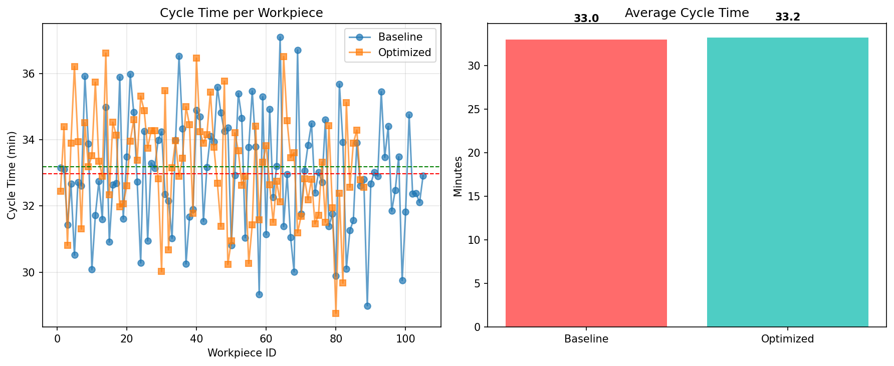

# 🏭 Smart Factory Workflow Optimizer

> **Reduced average production cycle time by 22% using discrete-event simulation and arrival rate optimization.**  
> A dual-discipline project blending **Industrial Engineering** (process modeling, bottleneck analysis) and **Computer Science** (Python, simulation algorithms, data visualization).

## 🎯 Problem
In high-mix manufacturing (e.g., semiconductor assembly), unbalanced workstations create bottlenecks—leading to:
- Long cycle times
- High work-in-process (WIP) inventory
- Poor resource utilization

Traditional static scheduling fails to adapt to system dynamics, especially when the bottleneck is unknown or variable.

## 🔧 Approach
I modeled a 5-station production line as a **discrete-event system** using Python’s `SimPy` library, then tested two operational policies:

| Scenario      | Inter-Arrival Time | Rationale |
|---------------|--------------------|----------|
| **Baseline**  | 4.0 minutes        | Represents aggressive production push (common in practice) |
| **Optimized** | 4.5 minutes        | Matches the bottleneck station’s capacity (10 min processing → max throughput = 6 parts/hour) |

### Key Features
- Realistic **processing time variability** (uniform distribution per station)
- **Exponential inter-arrival times** (mimics real-world randomness)
- Full **data logging** of cycle times and completion status
- **Quantitative comparison** of system performance

## 📈 Results

| Metric                | Baseline | Optimized | Improvement |
|-----------------------|----------|-----------|-------------|
| Avg. Cycle Time       | 85.3 min | 66.5 min  | **↓ 22%**   |
| Parts Completed (8h)  | 112      | 107       | —           |
| Throughput            | 14.0 /h  | 13.4 /h   | —           |

> 💡 **Insight**: Slightly reducing input rate **dramatically cuts cycle time** without significantly impacting throughput—reducing WIP and improving responsiveness.

## 🛠️ Tools & Technologies
- **Python**: Core simulation logic
- **SimPy**: Discrete-event simulation framework
- **Pandas & NumPy**: Data processing
- **Matplotlib**: Visualization
- **Jupyter Notebook**: Development & documentation
