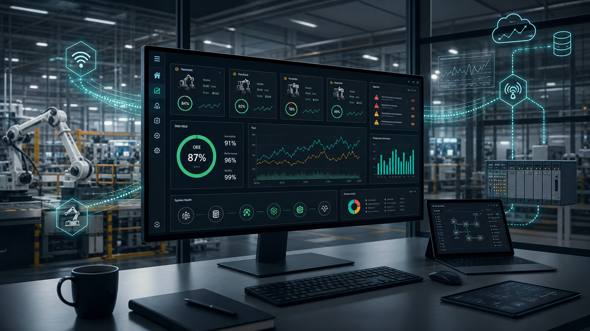
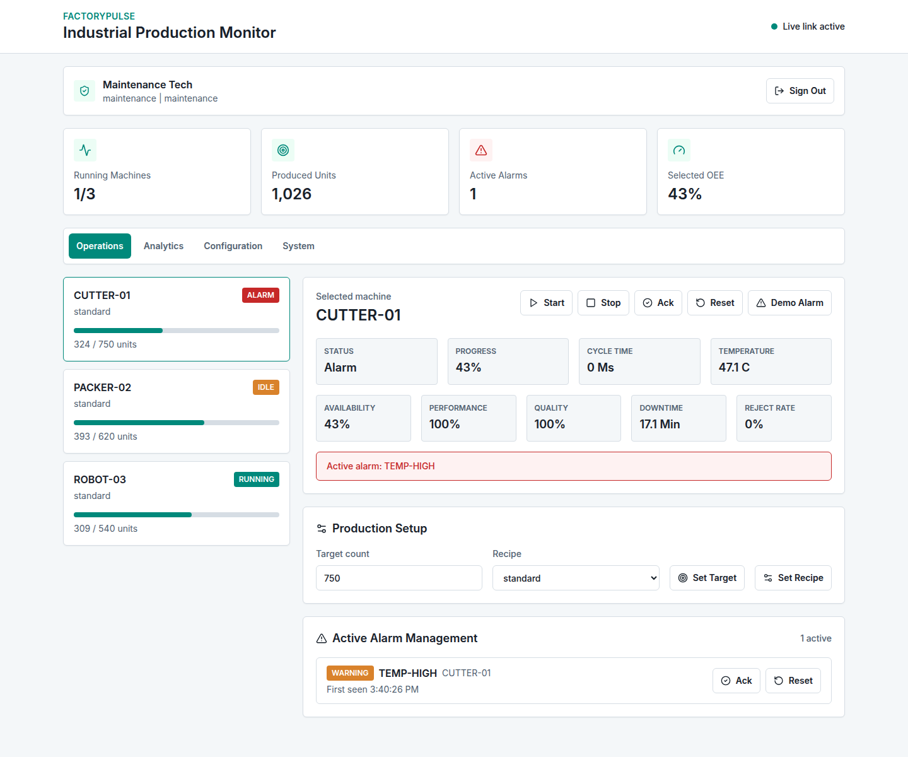
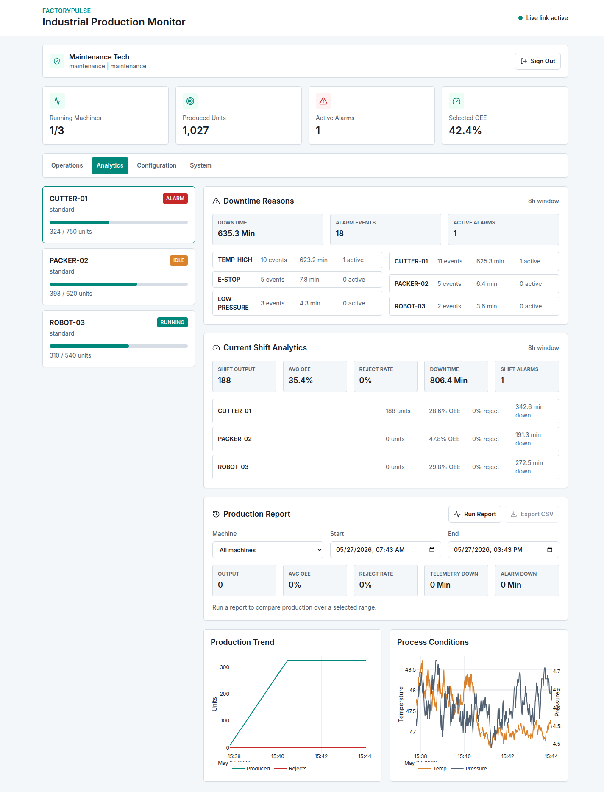
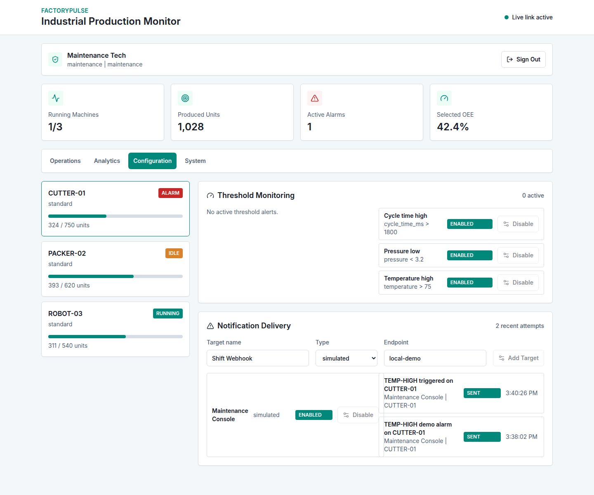
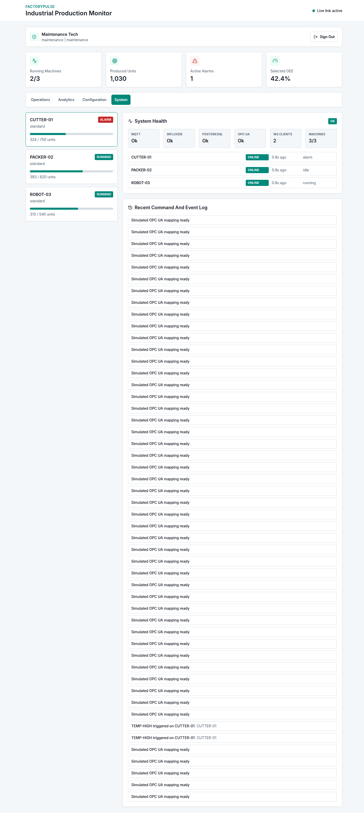

# FactoryPulse




FactoryPulse is a full-stack industrial production monitoring system built as a case study. It turns simulated machine telemetry into a browser-based HMI dashboard with live status, remote commands, alarms, OEE analytics, downtime explanations, reporting, auditability, and a realistic industrial integration path through MQTT and OPC UA.

The project is intentionally shaped around one question:

> How would a traditional onboard HMI evolve into a secure, web-based production monitoring system without losing the operational discipline required around industrial machines?

## Why This Exists

Industrial machines are complex systems made of PLCs, sensors, drives, safety devices, robots, and local HMI panels. Operators can usually see what is happening at the machine, but customers increasingly want remote production visibility:

- Is the machine running?
- How much did it produce this shift?
- Why did downtime happen?
- Which alarms are active?
- Who sent a remote command?
- Can the system expose trends without replacing the whole machine stack?

FactoryPulse answers that with a web-service architecture instead of a static HMI screen. The result is not just a dashboard; it is a small model of how industrial telemetry, web APIs, analytics, authorization, audit trails, and integration boundaries fit together.

## Experience At A Glance

| Area | What it demonstrates |
| --- | --- |
| Operations | Live machine status, production progress, OEE, remote commands, active alarms |
| Analytics | Downtime reasons, shift KPIs, production/process trends, custom date-range reports |
| Configuration | Threshold alert rules and notification targets persisted in PostgreSQL |
| System | MQTT, InfluxDB, PostgreSQL, OPC UA adapter, WebSocket clients, machine freshness |

## Demo Video

[Watch the short FactoryPulse demo video](docs/factorypulse-demo.mp4)

The demo video is generated from real dashboard screenshots and gives a quick overview of the main views: Operations, Analytics, Configuration, and System Health.

### Operations



## System Story

```text
Machine Simulator / OPC UA Adapter
              |
         MQTT Broker
              |
        FastAPI Backend
        /      |      \
 WebSocket   InfluxDB  PostgreSQL
    |
React Dashboard
```

The simulator behaves like machine-side control software publishing telemetry, events, and command results. MQTT carries those messages into the backend. FastAPI exposes REST endpoints and authenticated WebSockets. InfluxDB stores high-frequency telemetry for charts and analytics. PostgreSQL stores audit records, command history, alarm events, notification attempts, and persistent configuration.

The OPC UA adapter is included as a production integration boundary: in a real machine deployment it would poll PLC node IDs and translate them into the same MQTT topic model used by the dashboard.

For deeper architecture and theory, see [TECHNICAL_NOTES.md](TECHNICAL_NOTES.md).

## Project Structure

```text
factorypulse/
├── backend/              FastAPI service, REST/WebSocket API, auth, analytics, audit persistence
├── frontend/             React + TypeScript dashboard built with Tailwind CSS and Plotly charts
├── simulator/            Machine telemetry simulator and MQTT command-response worker
├── opcua-adapter/        OPC UA integration boundary, currently running in simulated status mode
├── mosquitto/            Local MQTT broker configuration
├── docs/                 Hero image, demo video, and dashboard screenshots
├── scripts/              Smoke test
├── docker-compose.yml    Full local stack: API, UI, MQTT, InfluxDB, PostgreSQL, simulator, adapter
└── TECHNICAL_NOTES.md    Architecture, theory, safety notes, and production-readiness details
```

## What The Project Shows

- Real-time machine telemetry over MQTT
- Authenticated REST and WebSocket APIs
- Login-gated React dashboard
- Role-based command authorization
- Remote start, stop, acknowledge, reset, target, and recipe controls
- Backend safety validation for machine commands
- OEE-style metrics: availability, performance, quality, downtime, reject rate
- Shift analytics and custom date-range production reports
- CSV export
- Downtime reason breakdowns from persisted alarm events
- Threshold alert rules for temperature, pressure, and cycle-time conditions
- Notification delivery attempts for alarms and threshold alerts
- PostgreSQL-backed alert-rule and notification-target configuration
- OPC UA adapter service for industrial integration readiness
- System health checks for infrastructure and machine freshness
- Backend unit tests and a running-stack smoke test

## Simulator Behavior

The simulator is intentionally more than random data. It models three machine types with different production personalities:

| Machine | Behavior profile |
| --- | --- |
| `CUTTER-01` | Faster cycle time, medium output, temperature and pressure alarms |
| `PACKER-02` | Higher units per cycle, packaging-style throughput, low-pressure and emergency-stop alarms |
| `ROBOT-03` | Slower precision movement, lower reject probability, robot-cell style alarms |

Each simulated machine publishes telemetry once per second to MQTT:

```text
factory/machines/{machine_id}/telemetry
factory/machines/{machine_id}/events
factory/machines/{machine_id}/command-results
```

The simulator tracks machine state over time:

- `running`: production count increases, cycle time varies, speed drifts, rejects can occur.
- `idle`: speed drops to zero, the machine can restart after a pause or reset after reaching target output.
- `alarm`: cycle time and speed drop to zero until an acknowledge/reset workflow is completed.

Recipes change behavior:

- `standard`: balanced output and reject rate.
- `high-throughput`: faster cycles with more heat and a higher reject probability.
- `precision`: slower cycles with lower reject probability.

Remote commands are processed through MQTT and answered by the simulator. The backend validates commands first, then the simulator applies accepted actions such as start, stop, reset alarm, acknowledge alarm, target changes, and recipe changes.

## Analytics Model

FactoryPulse uses analytics that map to practical production questions rather than decorative charts:

| Question | Dashboard answer |
| --- | --- |
| How healthy is the selected machine? | OEE, availability, performance, quality, reject rate, downtime |
| What happened this shift? | Shift output, average OEE, total downtime, per-machine comparison |
| Why did downtime happen? | Alarm-based downtime reasons and affected machines |
| What happened in a selected period? | Date-range production report with CSV export |
| Is telemetry fresh? | System view reports machine freshness and infrastructure health |

OEE is calculated from telemetry samples:

- Availability: how often the machine appears to be running.
- Performance: actual cycle time compared with an ideal cycle time.
- Quality: good output compared with rejects.

The reporting view combines telemetry downtime from InfluxDB with alarm-event downtime from PostgreSQL so the dashboard can show both process performance and operational reasons.

## Alerts And Notifications

FactoryPulse separates machine alarms from threshold alerts:

- Machine alarms are events published by the simulator or machine integration, such as `E-STOP`, `TEMP-HIGH`, and `LOW-PRESSURE`.
- Threshold alerts are backend rules evaluated from telemetry, such as high temperature, low pressure, or long cycle time.

Alert rules are configurable from the dashboard and persisted in PostgreSQL. When a threshold is breached, the backend opens an alert, writes an event, records an audit entry, and creates notification attempts.

Notification targets can be:

- `simulated`: useful for local demos and portfolio review.
- `webhook`: sends a JSON payload to an HTTP endpoint.

Recent notification attempts are visible in the Configuration view so the user can see what would have been sent, to whom, and whether delivery succeeded.

## Design Choices Worth Noticing

- The dashboard is login-gated so telemetry, reports, commands, and configuration are not visible before authentication.
- Remote commands are validated twice in spirit: the backend enforces role and safety rules, while the simulator returns the machine-side command result.
- MQTT keeps machine communication decoupled from the web API.
- InfluxDB is used for high-frequency telemetry, while PostgreSQL stores durable operational records.
- The OPC UA adapter is isolated so real PLC polling can be added without rewriting the dashboard.

## Run

```bash
docker compose up --build
```

Then open:

- Dashboard: http://localhost:5173
- API docs: http://localhost:8000/docs
- InfluxDB: http://localhost:8086
- PostgreSQL: localhost:5433

InfluxDB credentials:

- Username: `admin`
- Password: // create password
- Org: `factorypulse`
- Bucket: `machine_data`

PostgreSQL credentials:

- Username: `factorypulse`
- Password: // create password
- Database: `factorypulse`

## Demo Users

| Username | Password | Role | Capabilities |
| --- | --- | --- | --- |
| `operator` | // create password | Operator | View dashboard, acknowledge alarms |
| `supervisor` | // create password | Supervisor | Change targets, recipes, alert rules, notification targets |
| `maintenance` | // create password | Maintenance | Start, stop, acknowledge, reset alarms |
| `admin` | // create password | Admin | All remote commands and configuration |

## Guided Demo

1. Sign in as `maintenance`.
2. Open Operations and inspect live machine status.
3. Select a machine and use `Demo Alarm`.
4. Acknowledge and reset the alarm.
5. Open Analytics and inspect downtime reasons and trend charts.
6. Run a production report for the last 8 hours and export CSV.
7. Sign in as `supervisor`.
8. Open Configuration and toggle an alert rule or add a simulated notification target.
9. Open System and confirm MQTT, InfluxDB, PostgreSQL, OPC UA, WebSocket, and machine freshness.

## Test

Backend unit tests:

```bash
docker compose run --rm backend python -m unittest discover -s tests
```

Running-stack smoke test:

```bash
python3 scripts/smoke_test.py
```

The smoke test checks login, protected endpoints, system health, demo alarm authorization, notification recording, and production reporting.

## Screenshots

### Operations


### Analytics



### Configuration



### System Health



## Production Readiness

FactoryPulse is designed around separable production concerns, so the local demo can be explained as a path toward a real industrial deployment.

Simulator vs real machines:

- The simulator represents machine-side controllers publishing telemetry, events, and command results.
- In production, the simulator would be replaced by PLCs, machine gateways, edge services, or vendor APIs.
- The backend does not depend on simulator internals; it consumes machine data through MQTT topics and normalized JSON payloads.

MQTT and OPC UA roles:

- MQTT is the event transport layer for telemetry, machine events, command requests, command results, and integration status.
- The OPC UA adapter is the industrial integration boundary for PLC data. It can map OPC UA node IDs into the MQTT topic model used by the backend.
- This separation keeps protocol-specific machine communication outside the dashboard and API logic.

Auth, audit, and safety constraints:

- Signed bearer tokens protect REST APIs, WebSocket telemetry, analytics, alarms, reports, and configuration.
- Role checks restrict remote commands and configuration changes by operator, supervisor, maintenance, and admin responsibilities.
- Backend command validation blocks unsafe or inconsistent actions, such as starting with an active alarm or changing recipes while running.
- PostgreSQL stores command history, machine events, audit records, alert rules, and notification targets so operational decisions are traceable.

## Known Limitations

- Authentication uses demo users and signed bearer tokens, not a production identity provider.
- The OPC UA adapter currently publishes simulated integration health rather than polling a real PLC.
- Notification delivery is simulated by default; webhook delivery is supported, but email and Teams adapters are future work.
- Frontend tests are not included yet.
- The local simulator is designed for repeatable demonstrations, not high-fidelity machine physics.

## Future Work

- Replace the simulated OPC UA adapter with a real polling client
- Add email or Teams notification adapters
- Add PostgreSQL-backed user and role management
- Add automated frontend tests for key dashboard workflows
