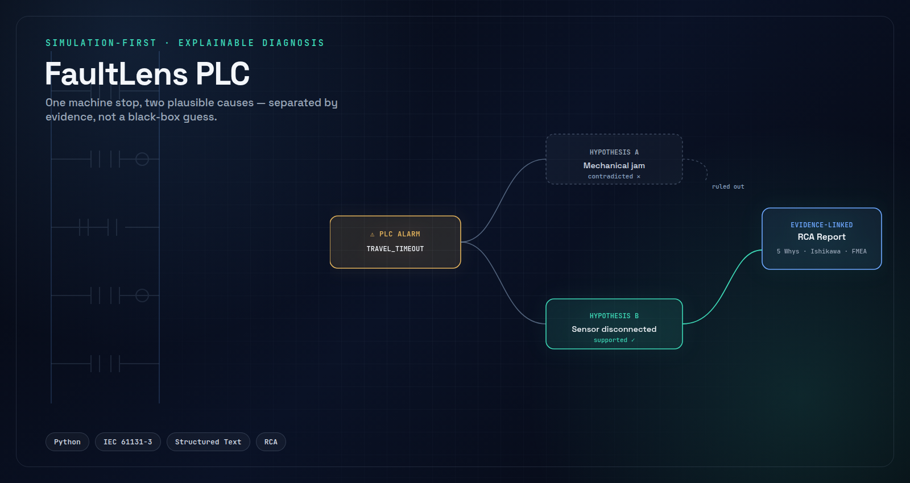
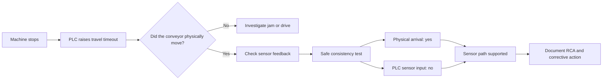
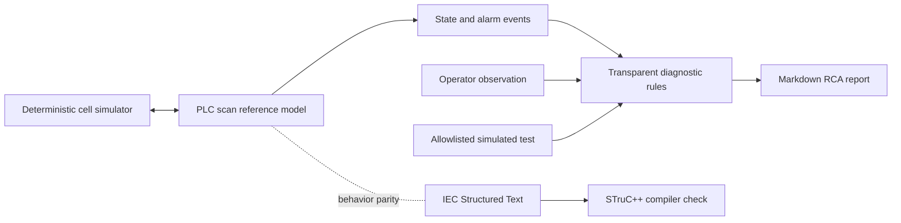

# FaultLens PLC


A simulated PLC troubleshooting assistant that turns one ambiguous alarm into a short, explainable investigation — instead of a black-box guess.



## The scenario

A conveyor stops mid-cycle. The PLC raises `CONVEYOR_TRAVEL_TIMEOUT`.

That single alarm is consistent with two very different problems: the conveyor is physically jammed, or a station sensor simply failed to report that the part had already arrived. From the alarm alone, a technician cannot tell which one they are walking up to. Every minute spent checking the wrong component is downtime that didn't need to happen.

**FaultLens PLC** is a small, dependency-free simulation that shows how PLC evidence, one targeted operator question, and a bounded diagnostic test can resolve that ambiguity — and how the result flows straight into the root-cause tools maintenance teams already trust: 5 Whys, Ishikawa, and FMEA.

## Watching the investigation happen



Run it yourself — the project has no dependencies beyond Python 3.10:

```bash
# See the ambiguous alarm: two plausible causes, one alarm
python3 -m faultlens.cli --scenario sensor_disconnected

# Add the operator's observation
python3 -m faultlens.cli --scenario sensor_disconnected --conveyor-moving yes

# Authorize the simulation-only test and produce an RCA worksheet
python3 -m faultlens.cli --scenario sensor_disconnected \
  --run-test sensor_consistency \
  --report reports/sensor-test.md
```

FaultLens first presents both credible explanations. It asks one useful question, and — only when authorized — runs a safe test inside the simulation. Every suggestion shows the evidence behind it. The final conclusion stays a human engineering decision.

## Following the evidence

The completed case follows a single scan-cycle trace from stop to root cause.

| Scan | Evidence | Interpretation |
| ---: | --- | --- |
| 0 | PLC state changed `IDLE → MOVING` | Travel sequence started |
| 0–6 | Conveyor command stayed active | Controller requested movement |
| 0–6 | Simulated part position advanced | Physical movement occurred |
| 2 | Simulated part reached the station | Expected sensing condition existed |
| 0–6 | PLC station input never went true | Feedback disagreed with physical state |
| 6 | PLC changed `MOVING → FAULT` | Supervision timer expired |
| 6 | `CONVEYOR_TRAVEL_TIMEOUT` latched | Symptom recorded; cause still ambiguous |

Two hypotheses stay open at the alarm alone. The operator's observation and the bounded test then pull them apart:

| Hypothesis | Alarm only | After movement observation | After consistency test |
| --- | --- | --- | --- |
| Conveyor mechanically blocked | Plausible | Contradicted | Contradicted |
| Station sensor / wiring failed low | Plausible | Supported | Supported by mismatch |

```text
Physical movement observed: yes
Physical station reached:   yes
PLC station input seen:     no
```

The mismatch localizes the fault to the sensing/feedback path. It does not, on its own, tell you whether the culprit is the sensor element, a connector, the cable, or the input channel — an electrical inspection still closes that gap on a real machine. That honesty is deliberate: FaultLens narrows the search, it doesn't pretend to finish it.

## From evidence to root cause

A supported hypothesis is a lead, not a report. FaultLens carries that lead into the RCA methods a maintenance team already runs:

- **5 Whys** turns the stop into an evidence-backed causal chain, down to the latent design weakness that one alarm covers two failure families.
- **Ishikawa** keeps the investigation from narrowing too early — machine, method, material, measurement, people, and environment are each checked and either supported or contradicted by the evidence, not assumed.
- **FMEA** feeds the incident back into prevention and detection: the case study shows the provisional risk score dropping once the consistency test is added as a standard response to this alarm.
- **Event timelines** keep observed facts (what the PLC and simulator actually recorded) separate from later interpretation (what a human concluded from them).

The full worked example — evidence timeline, competing hypotheses, 5 Whys, Ishikawa table, before/after FMEA, and corrective-action verification — is documented in the [disconnected-sensor case study](https://github.com/lewisndambiri/faultlens-plc/blob/main/docs/case-studies/sensor-disconnection.md).

## Does the test actually separate the faults?

Two scenarios were deliberately built to produce the *same* alarm from *different* causes, so the diagnostic logic has something real to fail at:

| Scenario | PLC alarm | Alarm-only candidates | Assisted, supported cause | Correct |
| --- | --- | ---: | --- | --- |
| `jam` | `CONVEYOR_TRAVEL_TIMEOUT` | 2 | Conveyor path is mechanically blocked | yes |
| `sensor_disconnected` | `CONVEYOR_TRAVEL_TIMEOUT` | 2 | Station sensor failed low or is disconnected | yes |

Alarm-only, zero of two cases are uniquely localized — both stay ambiguous. With the consistency test added, both are correctly separated. The scenario's ground truth is never passed to the diagnostic rules; it is only checked afterward, to score the result. That single bounded test is doing real discriminating work, not confirming what the system was already told.

## What's actually running underneath

There's no backend, no frontend, and no database — deliberately. FaultLens is a dependency-free Python package with a CLI, built around a real control-systems model rather than a simulated black box:



- A **cell simulator** models part movement, stopper timing, air pressure, sensor state, and I/O quality, deterministically enough that every failure and test is reproducible.
- A **PLC reference model** runs an explicit scan-cycle: states, timers, latched alarms, and reset behavior, mirroring how a real controller scans I/O and executes logic.
- The same sequence is also written as genuine **IEC 61131-3 Structured Text** (`plc/FaultLens.st`), with an equivalent **Ladder Diagram** documented network-by-network for anyone rebuilding it in OpenPLC Editor. STruC++ compiles the Structured Text to C++17, and a second `g++` pass verifies it — the control logic isn't just a Python stand-in, it's a program that actually compiles.
- **Diagnostic rules** map alarms to named hypotheses and pick a single discriminating question when evidence is ambiguous — as explicit rules with visible evidence, never a probability guessed by an opaque model.
- A **bounded procedure runner** allowlists exactly one simulation-only test (`sensor_consistency`); it cannot issue arbitrary PLC commands or touch physical I/O.
- **Reporting** turns the incident, evidence, and RCA scaffolding into an open Markdown worksheet a real investigation could actually use.

## Engineering evidence

- Six repeatable normal/fault scenarios, each independently reproducible
- A PLC-style scan-cycle and state-machine simulation
- A genuine IEC 61131-3 Structured Text implementation, with an equivalent Ladder Diagram design
- Latched alarms, timers, permissives, reset behavior, and fail-off outputs
- One human-in-the-loop diagnostic question, one allowlisted simulation-only test
- Evidence-linked RCA report generation
- 100 consecutive normal cycles verified
- 26 automated tests spanning behavior, safety boundaries, reports, and evaluation
- Successful IEC-to-C++ and C++17 compilation

```bash
make verify
```

runs the full check: Python tests, Structured Text compilation, generated-C++ compilation, and a fresh diagnostic evaluation.

## Honest boundaries

FaultLens is an educational, simulation-first project. It does not:

- control physical machinery, or connect to a live PLC through Modbus or OPC UA yet;
- implement or replace safety logic;
- use an LLM or an opaque model to declare a root cause;
- claim a measured reduction in real industrial downtime.

Those boundaries are deliberate. They keep the project small, reproducible, and fully explainable — every conclusion FaultLens surfaces can be traced back to a specific piece of evidence, which is the entire point.

## Explore the project

- [Completed RCA case study](https://github.com/lewisndambiri/faultlens-plc/blob/main/docs/case-studies/sensor-disconnection.md)
- [Diagnostic evaluation](https://github.com/lewisndambiri/faultlens-plc/blob/main/docs/evaluation.md)
- [Five-minute demo guide](https://github.com/lewisndambiri/faultlens-plc/blob/main/docs/demo-guide.md)
- [Traditional RCA methods guide](https://github.com/lewisndambiri/faultlens-plc/blob/main/docs/rca-methods.md)
- [Architecture and trust boundaries](https://github.com/lewisndambiri/faultlens-plc/blob/main/docs/architecture.md)
- [PLC Structured Text source](https://github.com/lewisndambiri/faultlens-plc/blob/main/plc/FaultLens.st)
- [Ladder Diagram design notes](https://github.com/lewisndambiri/faultlens-plc/blob/main/plc/ladder-design.md)
- [Full repository](https://github.com/lewisndambiri/faultlens-plc)
