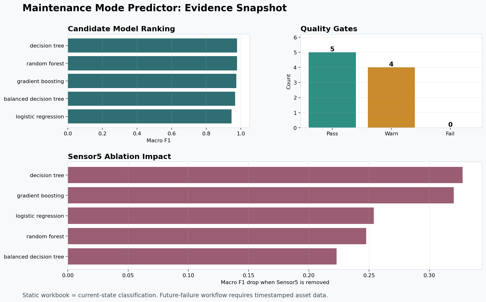
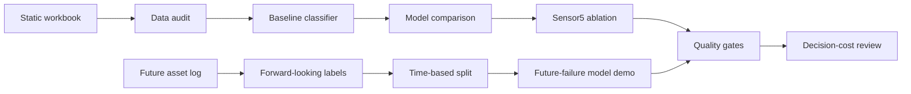

# Maintenance Mode Predictor

[](https://github.com/lewisndambiri/maintenance-mode-predictor/actions/workflows/ci.yml)


<p align="center">
  
</p>

This project began as a statistics class decision-tree notebook: classify whether a machine record looked like **Failure** or **Production** using maintenance and sensor data.

That was the classroom version.

The industrial-engineering version asks harder questions:

- Is the label actually defined correctly?
- Is the strongest signal a real pre-decision sensor, or leakage?
- Would this help maintenance planning, or only produce a good accuracy number?
- What data would be needed to move from current-state classification to true future-failure prediction?

The result is a compact predictive-maintenance workflow with audit reports, model comparison, decision-cost thinking, quality gates, and a synthetic temporal demo for the future-state architecture.

## The Short Version

| Area | Current State |
| --- | --- |
| Original data | Static Excel workbook, 353 rows |
| Current model boundary | Current-state classification, not real future-failure prediction |
| Baseline model | Interpretable decision tree |
| Main finding | `Sensor5` dominates the model and must be engineering-validated |
| Best static result | Decision tree / random forest around `0.9772` macro F1 in cross-validation |
| Biggest blocker | No timestamp, asset ID, or future failure horizon in the original workbook |
| Industrial upgrade | Future-data contract, temporal labeling, time-based split demo, quality gates |

## Why This Matters

In maintenance engineering, accuracy is not enough. A missed failure can mean unplanned downtime, safety exposure, damaged equipment, and production loss. A false alarm can mean unnecessary inspections, spare-part waste, and avoidable planned downtime.

So the project is intentionally framed around reliability questions:

```text
What does the model know?
When would it know it?
What action would a planner take?
What would a wrong prediction cost?
```

The original workbook can support a useful classification baseline. It cannot, by itself, prove predictive maintenance. That distinction is the backbone of the project.

## Evidence Snapshot

<p align="center">
  
</p>

Key generated reports:

- [Data audit](reports/data_audit.md)
- [Model report](reports/model_report.md)
- [Model comparison](reports/model_comparison.md)
- [Decision-cost report](reports/decision_policy_report.md)
- [Quality gates](reports/quality_gates.md)
- [Synthetic temporal model report](reports/future_model_report.md)

## What The Project Found

Under the current label assumption, `Operation_modes` means:

| Label | Meaning | Complete-case rows |
| ---: | --- | ---: |
| `0` | Failure | 253 |
| `1` | Production | 93 |

That distribution matters because the original project text described production as the majority class. The repo now treats that as a governance issue, not a footnote.

Static model comparison:

| Model | Uses `Sensor5` | Accuracy | Macro Recall | Macro F1 |
| --- | --- | ---: | ---: | ---: |
| Decision tree | Yes | 0.9826 | 0.9711 | 0.9772 |
| Random forest | Yes | 0.9826 | 0.9711 | 0.9772 |
| Gradient boosting | Yes | 0.9797 | 0.9656 | 0.9732 |
| Balanced decision tree without `Sensor5` | No | 0.7860 | 0.7613 | 0.7442 |
| Decision tree without `Sensor5` | No | 0.7369 | 0.6483 | 0.6496 |

The baseline decision tree is deliberately kept because it is simple, inspectable, and easy to explain. But the result is only respectable if the strongest feature is valid.

## The Sensor5 Question

`Sensor5` has about `0.9856` feature importance in the baseline tree. Removing it drops macro F1 by up to `0.3275` across model families.

That can mean one of two very different things:

- `Sensor5` is a physically meaningful condition signal.
- `Sensor5` is an alarm/status/diagnostic field that leaks the answer.

An industrial engineer should not deploy the model until this is resolved. The quality-gates report keeps this warning visible on every full run.

## What Is Credible Today

This project is credible as:

- a statistics-class model matured into an industrial analytics workflow,
- a reproducible current-state classification baseline,
- a model-risk and data-governance case study,
- a predictive-maintenance scaffold for when timestamped asset data exists.

It is not yet credible as:

- an operational predictive-maintenance system,
- an automatic work-order trigger,
- a safety-critical decision tool,
- proof of future-failure prediction from the original workbook.

## Industrial Architecture



## Run It

Install:

```bash
python3 -m pip install -r requirements.txt
```

If you are using the local `myenv` virtual environment:

```bash
source myenv/bin/activate
```

Run the full reproducible workflow:

```bash
python3 scripts/run_all.py
```

or:

```bash
make run-all
```

The full workflow regenerates reports, model artifacts, static scoring outputs, temporal-demo outputs, quality gates, and tests.

Expected ending:

```text
Ran 20 tests
OK
All workflow steps completed.
```

Useful individual commands:

```bash
make audit          # data quality and label audit
make train          # baseline decision-tree report
make compare        # candidate model comparison
make decision       # assumed maintenance cost thresholds
make quality        # reproducibility and industrial-risk gates
make test           # unit tests
```

## Notebook

The notebook is still here: [maintenance_analysis.ipynb](maintenance_analysis.ipynb)

It is intentionally output-light and narrative-driven. It is the lab bench for EDA, plots, leakage intuition, and industrial interpretation. The scripts are the repeatable production-style workflow.

## Future Predictive Maintenance Path

The original workbook has no asset timeline, so the repo includes a future-data contract and a synthetic temporal demo.

A real future-failure dataset should contain:

- `asset_id`
- `prediction_timestamp`
- raw sensor values known at prediction time
- maintenance action history
- `failure_timestamp`
- failure mode
- downtime and repair cost

Then labels can be built honestly:

```text
failure_within_7_days = 1
if a failure occurs after prediction_timestamp
and within the next 7 days
```

Demo commands:

```bash
python3 scripts/generate_synthetic_future_log.py \
  --output reports/synthetic_future_log.csv \
  --assets 12 \
  --days 90 \
  --seed 42

python3 scripts/train_future_model.py \
  --input reports/synthetic_future_log.csv \
  --horizon-days 7 \
  --test-start 2026-03-01T00:00:00Z
```

The synthetic demo proves the workflow mechanics only. It is not real maintenance evidence.

## Repository Map

| Path | Purpose |
| --- | --- |
| `maintenance_analysis.ipynb` | Exploratory notebook and story-building workspace |
| `src/maintenance_predictor/` | Reusable data, modeling, temporal labeling, decision, and quality-gate logic |
| `scripts/` | Command-line workflows |
| `reports/` | Generated evidence and review artifacts |
| `docs/data_dictionary.md` | Feature and label-governance notes |
| `docs/future_data_contract.md` | Required schema for real predictive-maintenance data |
| `docs/implementation_plan.md` | Phased engineering roadmap |
| `templates/` | Starter future-maintenance CSV template |
| `assets/` | README visuals |

## Model Card In Brief

| Item | Value |
| --- | --- |
| Model type | `DecisionTreeClassifier` baseline |
| Current use | Portfolio, analysis, and current-state classification |
| Not for | automated shutdowns, safety-critical actions, automatic work orders |
| Main risk | label ambiguity and possible `Sensor5` leakage |
| Required before pilot | validate labels, sensors, timing, costs, asset/time split |

## Quality Gates

The latest quality-gates run has:

| Status | Count |
| --- | ---: |
| Pass | 5 |
| Warning | 4 |
| Failure | 0 |

The warnings are intentional and important:

- label distribution must be confirmed,
- `Sensor5` dominance must be explained,
- `Sensor5` ablation impact blocks model selection,
- synthetic future workflow is not real operational evidence.

## License

MIT License. See [LICENSE](LICENSE).
