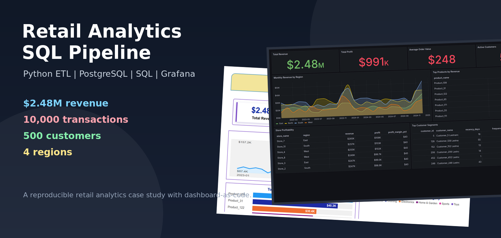
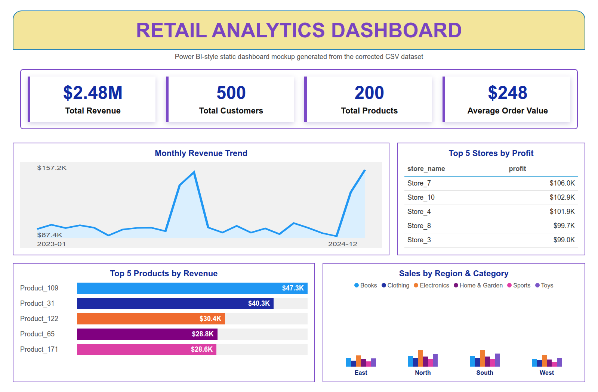
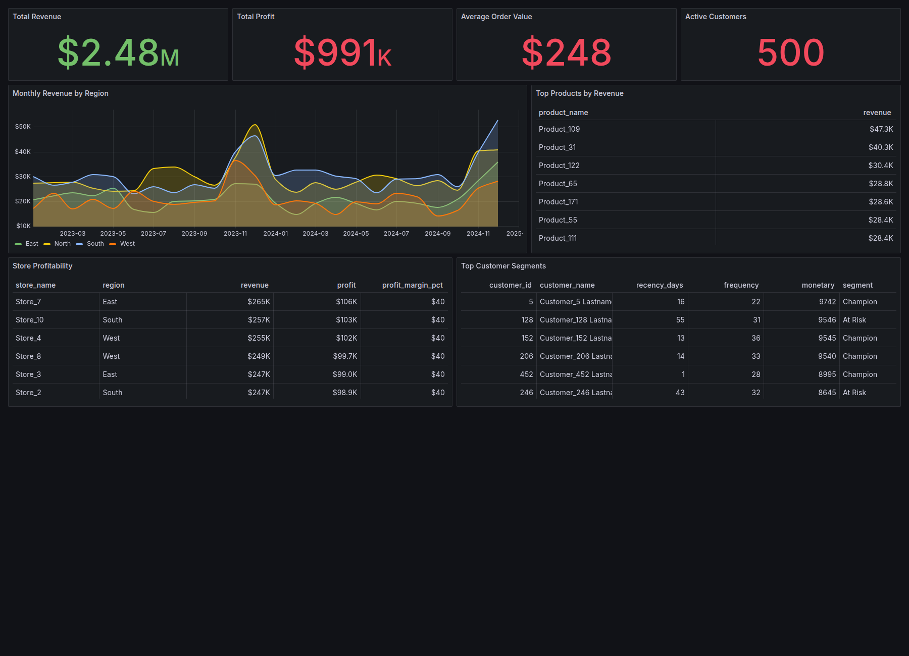
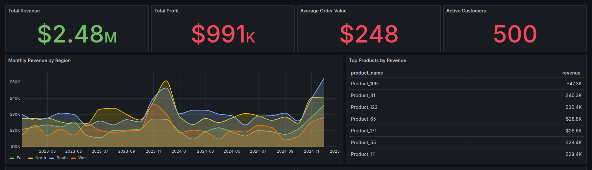
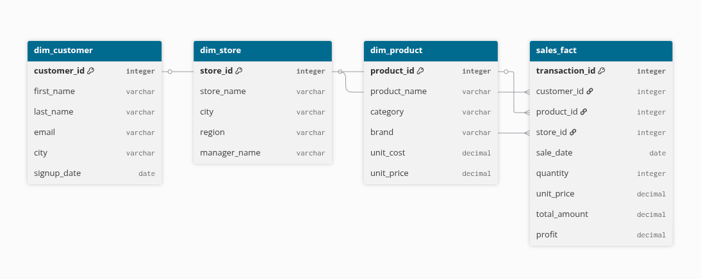

# Retail Analytics SQL Pipeline




Retail leaders rarely struggle because they have no data. They struggle because sales, customers, stores, products, and performance targets often live in separate places. By the time those numbers are stitched together manually, the business has already moved on.

This project tells that story as a compact but complete analytics build: synthetic retail transactions are generated, loaded into a PostgreSQL star schema, analyzed with business-focused SQL, and visualized through an executive-style BI report plus a provisioned Grafana dashboard.

The result is a reproducible analytics pipeline that answers practical retail questions:

- Which stores and regions are driving revenue?
- Which products are creating the most value?
- How are revenue and profit trending over time?
- Which customers look loyal, high value, new, or at risk?
- How can the same warehouse support executive BI and operational dashboards?

## Final Dashboards

The executive report below is a Power BI-style static mockup generated from the corrected CSV dataset. It is included as a portfolio visual preview, not as an exported `.pbix` screenshot.



Grafana is added as a provisioned, database-backed dashboard so the project also demonstrates dashboard-as-code and repeatable local deployment.



The Grafana view focuses on live SQL-backed monitoring: revenue, profit, AOV, active customers, regional trends, top products, store profitability, and customer segments.



## Project Narrative

The project starts with a realistic business problem: leadership needs a single view of retail performance. The raw inputs are transactional sales, customers, products, and stores. On their own, those CSV files are useful but not decision-ready.

The first step is data generation. The Python generator creates reproducible synthetic data across 2023 and 2024, including seasonality in Q4 sales volume. Product prices, transaction totals, and IDs are generated consistently so downstream product and profit analysis remains trustworthy.

The second step is modeling. The data is loaded into PostgreSQL using a star schema:

- `sales_fact` stores each transaction and measurable facts such as quantity, revenue, and profit.
- `dim_customer` stores customer identity and signup attributes.
- `dim_product` stores product, category, brand, cost, and price.
- `dim_store` stores geography and regional ownership.
- `dim_date` supports time-based filtering and reporting.



The third step is analysis. The SQL suite uses CTEs, window functions, ranking, rollups, cohort logic, and RFM-style segmentation to move from raw transactions to business questions. Instead of only showing simple totals, the queries explore growth, profitability, customer behavior, and regional performance.

The final step is visualization. The BI-style report presents a polished executive view, while Grafana gives a repeatable dashboard that can be started locally from the repo with Docker Compose.

## Analytics Covered

The SQL analysis covers:

- Monthly revenue trends and growth rates.
- Running revenue totals by region.
- Top products by quantity and revenue.
- Top products per store using window functions.
- Category and store rollups.
- Store-level AOV and profitability.
- Customer purchase summaries.
- Cohort retention analysis.
- RFM-style customer segmentation.
- Target vs actual KPI analysis.

## Validation Snapshot

The generated dataset is designed to be small enough to run locally but large enough to support meaningful dashboard slices:

```text
customers: 500
products:  200
stores:    10
dates:     731
sales:     10,000
revenue:   2.48M
```

The generated sales data is also checked for basic integrity:

```text
duplicate transaction IDs: 0
product price mismatches:  0
```

## Technology Choices

- **PostgreSQL** for the analytical warehouse.
- **Python, Pandas, and SQLAlchemy** for data generation and ETL.
- **Advanced SQL** for business analysis and segmentation.
- **Power BI-style static report mockup** for executive reporting.
- **Grafana** for a provisioned dashboard-as-code workflow.
- **Docker Compose** for a reproducible local PostgreSQL + Grafana demo.

## What This Demonstrates

This project is intentionally compact, but it touches the core workflow behind many real analytics systems: create reliable data, model it for analysis, write SQL that answers business questions, and publish the results in tools that different audiences can use.

The executive report tells the business story. Grafana proves the dashboard can be provisioned and rerun. PostgreSQL and SQL hold the center.

→ [View on GitHub](https://github.com/lewisndambiri/retail-analytics-sql)
